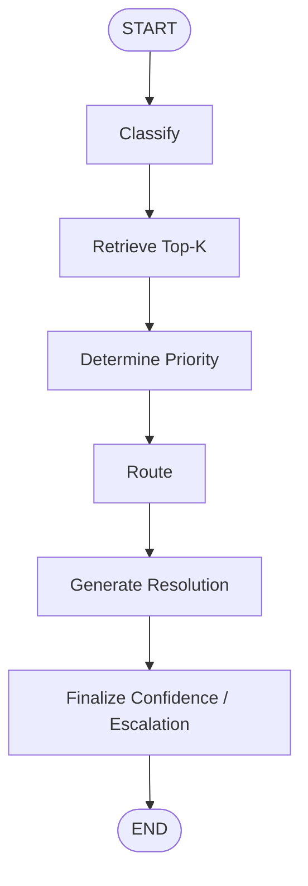

# AI-powered Smart Inquiry Triage Assistant

## Business Problem

A large automotive company receives hundreds of customer inquiries a day across its digital
channels — questions about vehicle features, service appointments, warranty terms, ordering,
and technical issues. Today someone reads each message, decides what it's about, how urgent it
is, and who should handle it. This manual process is slow, inconsistent between reviewers, and
doesn't scale with volume.

This prototype automates that first triage step: given a raw customer inquiry, it classifies it
into a canonical category, infers a priority, routes it to the right team's queue, and drafts a
short resolution note grounded in similar historical cases. When the system isn't confident in
its own classification, it escalates the case to a human reviewer instead of guessing.

## Solution Overview

```
Inquiry
  → taxonomy-constrained classification
  → Top-K historical retrieval
  → priority inference (from the retrieved Top-K)
  → deterministic routing
  → grounded resolution note
  → evidence-based confidence + escalation
```

The pipeline is implemented as a **LangGraph** workflow (`src/main.py`) backed by a local Ollama
chat model, a local embedding model, and a Chroma vector store over 300 historical cases
(`data/past_cases.csv`). The Streamlit app (`app/app.py`) is a thin UI over the single public
entrypoint `src.main.triage_inquiry(query, top_k, confidence_threshold)`.

## Architecture



Each box is a distinct LangGraph node operating on one shared, typed state object
(`TriageState`) — no hidden steps, no single giant function doing everything.

## Why LangGraph?

The task has five required, ordered stages, a mix of deterministic and model-driven steps, and a
genuine need to inspect intermediate decisions (what did the classifier decide, what did
retrieval return, before confidence is finalized). LangGraph fits that shape directly:

- **Explicit ordered stages** — the graph's edges *are* the required workflow order, not an
  implicit convention buried in a function body.
- **Shared typed state** — every node reads/writes a single `TriageState` TypedDict, so each
  stage's inputs/outputs are explicit and testable in isolation.
- **Inspectable intermediate decisions** — classification source, retrieval evidence, and the
  three confidence signals are all visible on the graph's final state (not exposed in the public
  UI contract, but available for tests, evaluation, and debugging).
- **Deterministic + model-driven steps side by side** — routing uses a deterministic data-derived lookup;
  retrieval calls the embedding model and vector store, while classification and resolution-note
  generation call the chat model. The graph doesn't care which is which.
- **A clear extension point** — confidence/escalation finalization was added as one more node
  after the five required stages, without touching anything upstream.

This is not a claim that LangGraph is necessary for every classifier — a single well-tested
function would do for a one-step task. LangGraph makes the ordered multi-stage workflow and
shared state explicit, while node-local retry/fallback logic and final escalation remain
independently testable. The production graph itself is linear (`classify → retrieve →
determine_priority → route → generate_resolution → finalize_confidence_and_escalation`, one edge
after another) — retry/fallback is control flow *inside* the classification node, not a
conditional LangGraph edge, and escalation is a decision computed in the final node, not a graph
branch. No conditional edges were added just to make this section sound more sophisticated than
the implementation actually is.

## Models

| | Model | Why |
|---|---|---|
| Chat | `qwen2.5:1.5b-instruct` (Ollama) | Local, no API key, reproducible for anyone cloning this repo, and small enough to match the case study's "1–4B params, reply quality secondary" guidance while still supporting Ollama's structured JSON-schema output reliably. |
| Embeddings | `nomic-embed-text` (Ollama) | 768-dim, well-supported in the Ollama + Chroma + LangChain stack, good quality/size trade-off for short single-sentence inquiries. |
| Runtime | Ollama (local server) | Avoids coupling the prototype to a paid external API and avoids distributing credentials in a public repo — the trade-off is that Ollama itself must be installed locally (see Setup). |

This is not a claim that Qwen2.5-1.5B is the best model available generally — it was chosen as a
small, local, reproducible starting point and evaluated on its own merits (see Evaluation below).

## Retrieval

Historical cases (`data/past_cases.csv`, 300 rows) are embedded once with `nomic-embed-text` and
stored in a local, persistent **Chroma** collection (`.chroma/`, gitignored) using cosine
distance. Top-K similarity search is configurable from the UI (default `K=5`). A **corpus
fingerprint** (hash of the row data + embedding model + a schema version) is stored alongside the
collection; the collection is only reused when the fingerprint matches what's currently on disk,
and rebuilt otherwise — this prevents a stale index silently surviving a data or config change.

## Classification

`data/taxonomy.json` is the single source of truth for the 8 canonical categories — nothing
duplicates the category list elsewhere. The classifier receives the **complete taxonomy**
(name + description + keywords for every category) as context and is constrained to return only
one of those 8 labels via a Pydantic `Literal`-typed structured-output schema.

Failure handling: a structured classification attempt is made; if the output is malformed or
otherwise unusable, one retry is attempted; if that retry is also unusable, a deterministic
taxonomy keyword-evidence fallback runs (falling back to the safe `other` category when the
evidence itself is ambiguous or absent). Reaching this fallback — for any reason — always forces
`classification_failed = True`, which later forces escalation regardless of any other signal.
This is a distinct mechanism from low confidence on an otherwise-valid classification: a
low-evidence-but-structurally-valid prediction is handled separately, later, by ordinary
threshold-based human escalation, not by the fallback path.

**In evaluation, this fallback was never actually needed** — the structured classifier produced
usable output on the first attempt for all 300/300 held-out cases. It exists as a safety net for
genuinely malformed or unparseable model output, not because it was a frequent occurrence.

## Priority

Priority is derived from the retrieved Top-K historical neighbors, as required — never guessed
directly by the LLM. Two methods were implemented and compared:

- **Majority vote** (baseline) — the priority most common among the Top-K neighbors.
- **Similarity-weighted vote** (candidate) — each neighbor's priority is weighted by its
  similarity score before voting.

The leakage-safe evaluation (below) found the two methods produced **the exact same prediction on
all 300 held-out cases** — zero disagreements. With no measurable difference, the simpler
majority-vote method was retained rather than switching to the more complex weighted variant for
no benefit.

## Routing

`data/past_cases.csv` was inspected and validated: every one of the 8 categories maps to exactly
one `routed_queue`, with no exceptions. This category → queue mapping is **derived from the CSV
at runtime** (not hand-coded) and validated to still be a strict 1:1 mapping every time it's
built. Because the relationship is genuinely deterministic in the data, routing uses a direct
lookup rather than an LLM call — avoiding introducing model uncertainty into a decision the data
already answers exactly.

## Confidence and Human Escalation

Three evidence signals are computed separately from the retrieved Top-K, each observable on its
own:

- **retrieval strength** — the single strongest retrieved similarity (`max(similarity)`).
- **category agreement** — the similarity-weighted fraction of retrieved neighbors that share the
  predicted category.
- **category evidence margin** — the normalized similarity-weighted gap between the predicted
  category's evidence and its strongest competitor among the retrieved neighbors.

The prototype's confidence score is the **unweighted mean of these three signals**
(`evidence_mean`), selected over a "retrieval strength alone" baseline by the evaluation below.

**This is an evidence score used for selective escalation, not a statistically calibrated
probability of correctness.** No arbitrary or learned weighting was introduced, and no claim is
made that a confidence of, say, 0.7 means "70% likely correct" — evaluation showed the achievable
full-triage reliability among auto-triaged cases tops out around ~51% at the best threshold
tested, far below what a calibrated probability would imply. See Evaluation for the numbers this
claim is based on.

Escalation rule:

```
escalated = classification_failed OR confidence < confidence_threshold
```

`classification_failed` always forces escalation regardless of the numeric confidence. Otherwise,
escalation triggers when confidence is strictly below the threshold (a confidence exactly equal
to the threshold does **not** escalate). Default threshold: **0.50**, configurable in the UI.

## Resolution Notes

A short 1–2 sentence resolution note is generated from the current query, predicted category,
determined priority, and the retrieved historical cases — always generated, including for cases
that end up escalated (escalation means "verify this triage result," not "skip the draft").

The retrieved cases are explicitly framed to the model as **context/examples only, not facts
about the current customer** — the prompt instructs the model not to copy specific names, events,
links, or procedural details out of them. A further anti-fabrication instruction discourages inventing
account/payment/refund status, warranty eligibility, order/delivery status, prices, appointment
availability, delivery dates, unsupplied vehicle facts, claims that an action already happened, or
specific UI controls/menu paths not mentioned by the customer. Output is normalized (whitespace
collapsed) and validated to be non-empty and no more than 2 sentences; an unusable note triggers
one retry, then a hard `ResolutionGenerationError` rather than a silently fabricated generic note.

## Evaluation

**Design:** leakage-safe **stratified 5-fold cross-validation** over all 300 cases (fixed random
seed 42). Each fold trains on 240 cases and holds out 60; a **temporary, fold-specific Chroma
index built only from that fold's training rows** is used for retrieval, so a held-out inquiry can
never retrieve itself (or any other held-out case in its fold) — verified both structurally and
with a runtime assertion that fired zero times across all 300 evaluations. `K=3` and `K=5` were
both evaluated (derived from one `K=5` retrieval call per case, not two). Resolution notes are not
generated during evaluation — irrelevant to the metrics measured and pure wasted inference time.

**Results:**

| Metric | Result |
|---|---|
| Category accuracy | 241/300 = 80.33% |
| Routing accuracy | 241/300 = 80.33% (mathematically tied to category accuracy — routing is a deterministic function of predicted category) |
| Priority accuracy, K=3 (majority) | 162/300 = 54.0% |
| Priority accuracy, K=5 (majority) | 167/300 = 55.67% |
| Priority accuracy, K=5, true=high | 28/54 = 51.85% |
| Priority accuracy, K=5, true=medium | 41/100 = 41.0% |
| Majority vs. weighted priority disagreements | 0/300 |

Confidence (`evidence_mean`) at `K=5` — **full-triage reliability** is defined as: among
non-escalated cases, the percentage where predicted category, predicted priority, and routed
queue are **all three** correct:

| Threshold | Coverage (auto-triaged) | Full-triage reliability |
|---|---|---|
| 0.40 | 68.0% | 50.5% |
| 0.50 | 59.7% | 51.4% |
| 0.60 | 45.7% | 50.4% |
| 0.70 | 30.7% | 50.0% |
| 0.80 | 21.0% | 50.8% |

**Honest read of these numbers:** classification is reasonably strong for a 1.5B local model on
this taxonomy (80.33%, with billing and other at 100%). **Priority inference from Top-K neighbors
is the clear bottleneck** — accuracy sits around 55%, and the `medium` class in particular is
barely distinguishable from `low`/`high` under neighbor voting. `evidence_mean` is a more usable
selective-automation signal than raw retrieval strength alone (which actually got *less* reliable
as its threshold rose, the opposite of what a useful signal should do), but it does not achieve
high full-triage reliability at any tested threshold — reliability sits flat around ~50–51%
regardless of threshold. **This prototype demonstrates the mechanics of selective escalation, not
production-ready autonomous triage.** Full methodology, per-category/per-priority breakdowns, and
confusion matrices are in `evaluation/results.json` and `evaluation/predictions.csv`.

## Limitations

- Only 300 historical cases, synthetic/curated for this exercise — not real customer data.
- Priority signal is weak, especially for the `medium` class (~41% accuracy at K=5).
- All evaluation is bound to this one taxonomy; results say nothing about a different category set.
- One local chat model (`qwen2.5:1.5b-instruct`) and one embedding model (`nomic-embed-text`) —
  results are specific to this pairing.
- Confidence (`evidence_mean`) is an evidence score, not a calibrated probability — it has not
  been validated to rank "more confident" predictions as reliably more correct.
- No real post-deployment outcomes exist to validate any of this against.
- Resolution-note quality was inspected qualitatively (a handful of examples, checked for
  fabrication) — not evaluated against human-authored production labels.
- Retrieved historical cases are intended as handling context/examples, not current-case facts,
  but qualitative live testing showed the lightweight local generator can occasionally promote
  specific details from a highly similar retrieved case into the current resolution note despite
  explicit grounding instructions. Qualitative observations suggested improvement after strengthening
  the instructions, but did not establish a quantified reduction or elimination of the behavior — a
  stronger generator and/or a quantitatively evaluated grounded-output check are
  reasonable production improvements to evaluate, not evidence the underlying architecture can't
  be grounded.

## Production Roadmap

**ML improvement:**
1. Collect human corrections and real triage outcomes to replace/augment the synthetic dataset.
2. Improve priority prediction with richer evidence than Top-K neighbor voting (the current,
   evaluation-confirmed bottleneck).
3. Calibrate confidence against real deployment outcomes, not just held-out cross-validation.
4. Monitor for distribution shift and emerging inquiry types not represented in the taxonomy.

**Engineering:**
1. Expose the pipeline through a proper service/API layer.
2. Integrate with a real ticketing/CRM system instead of a chat UI.
3. Add monitoring/observability around classification confidence, escalation rate, and latency.
4. Build a persistent human-review feedback loop so escalated/corrected cases feed back into
   future evaluation and (eventually) retraining.

A small, optional step toward the "downstream integration" item above is already implemented —
see below.

## Optional Downstream Notifications (n8n)

After rendering a newly generated **successful** triage result, the application optionally makes
a synchronous webhook POST with a 3-second HTTP timeout. It sends seven selected result fields
with their names and values unchanged to n8n. n8n does not participate in AI reasoning; it receives
the result only after classification, retrieval, priority, routing, resolution notes, and confidence/escalation
have all already been decided by the LangGraph pipeline.

- **Optional and off by default.** Set the `TRIAGE_N8N_WEBHOOK_URL` environment variable to enable
  it; leave it unset and `src/notifications.py` is a no-op. The main demo runs with it disabled.
- **Cannot affect triage.** A webhook failure, timeout, or unreachable n8n instance is caught and
  logged in `src/notifications.py` — these delivery failures do not alter or fail the completed
  triage result, and no retry is attempted.
- **Every successful result is sent**, not just escalated ones — Python does not pre-filter which
  results reach the workflow layer. n8n applies its own downstream business rules (see
  `n8n/triage-notifications.workflow.json`): an escalated result routes to an escalation
  notification; otherwise a `high`-priority result routes to an urgent notification; otherwise no
  action. Escalation is checked first, so an escalated-and-high-priority result triggers exactly
  one notification, never two.
- **Downstream rules can change independently of the AI pipeline** — the n8n workflow can be edited
  without touching `src/main.py`, and vice versa.
- n8n itself is not installed, configured, or run as part of this repository, and no credentials
  are included. See `n8n/README.md` for manual setup steps and the exact webhook payload shape.

## Setup

Tested on Windows with Python 3.10.

1. **Install Python** (3.10+) if not already installed.
2. **Create and activate a virtual environment:**
   ```
   python -m venv .venv
   .venv\Scripts\activate
   ```
3. **Install dependencies:**
   ```
   pip install -r requirements.txt
   ```
4. **Install Ollama** (local LLM runtime): https://ollama.com/download — or via winget:
   ```
   winget install --id Ollama.Ollama -e
   ```
5. **Pull the required models:**
   ```
   ollama pull qwen2.5:1.5b-instruct
   ollama pull nomic-embed-text
   ```
6. **Run the app:**
   ```
   streamlit run app/app.py
   ```
   Then open http://localhost:8501 and paste a customer inquiry.

   Optional: to enable the n8n downstream notification (see above), set `TRIAGE_N8N_WEBHOOK_URL`
   before starting Streamlit. Leave it unset to run without it.

**Run the test suite:**
```
python -m pytest tests/ -q
```

**Run the leakage-safe evaluation** (rebuilds temporary per-fold indexes, does not touch the
production `.chroma/` store; takes several minutes on CPU):
```
python -m evaluation.evaluate
```
Results are written to `evaluation/results.json` and `evaluation/predictions.csv`.
